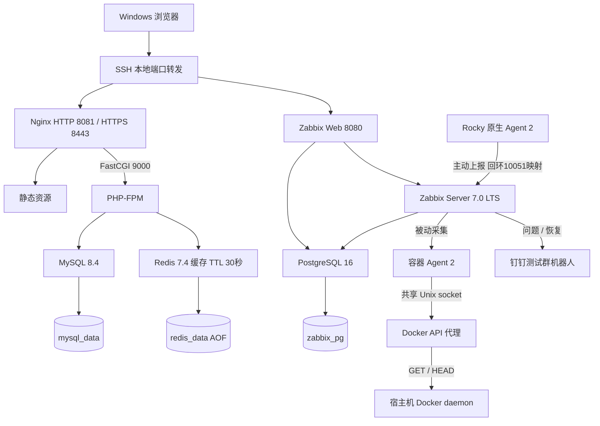

# LNMP 自动化部署与监控：项目总结

整理日期：2026-10-09。环境：个人笔记本上的 Rocky Linux 9 虚拟机，约 2 核 CPU、5.5 GiB 内存；Windows 通过 SSH 操作。目标是完成可运行、可观察、可恢复的单机运维实验，不是生产高可用方案。

本文区分已完成的历史验证与供复现使用的操作步骤。命令不会因写入文档而自动执行；生产环境的配置、重启、故障注入及恢复需先确认影响和审批。

## 1. 架构图



Compose 包含 9 个服务。Nginx→PHP 使用 FastCGI，不是 HTTP proxy_pass；Docker API 代理才使用 HTTP 反向代理。web、backend、zabbix 三个网络分组用于组织通信，不能等同于完整安全隔离。

## 2. 部署文档

仓库：[Du09339/lnmp-zabbix](https://github.com/Du09339/lnmp-zabbix)。源码、配置模板和压测证据已公开，真实环境配置和数据不公开。

- [Rocky 部署指南](Rocky-Deployment.md)：部署、访问和基本维护。
- [宿主机监控](Rocky-Host-Monitoring.md)：原生 Agent 接入。
- [性能测试记录](Redis-Performance-Test-Log.md)：六轮数据及实验限制。
- [历史复盘](Rocky-Lab-Deployment-Review-2026-10-05.md)：初始部署与排障。

历史项目目录为 `/home/dpc/lnmp-zabbix`。命令中的 `<PROJECT_DIR>`、`<HOST>`、`<SERVICE>`、`<BACKUP_FILE>` 等必须替换后执行。已有机器部署成功；全新环境重新部署尚无验收证据。

## 3. 配置文件说明

| 文件或目录 | 用途与注意点 |
| --- | --- |
| compose.yaml | 服务、镜像、端口、依赖、健康检查、网络与命名 Volume |
| .env.example | 非敏感参数模板，复制后设置本机密码 |
| .env | 实际密码与环境变量，不提交；修改不会自动修改已有数据库账户 |
| php/Dockerfile、opcache.ini | 构建 PDO MySQL、OPcache、Redis 扩展及 PHP 运行设置 |
| app/public/index.php | MySQL 查询、Redis 缓存、首页及 healthz 响应 |
| app/healthcheck.php | PHP 容器依赖健康检查 |
| nginx/conf.d/default.conf | 静态文件处理、缓存响应头、FastCGI 转发 |
| nginx/conf.d/https.conf.example | HTTPS 模板，由证书脚本复制为 https.conf |
| mysql/init/001-app.sql | 首次空数据目录初始化表与示例数据，已有 Volume 不重复执行 |
| docker-socket-proxy/nginx.conf | 将 Docker API 转发到共享 Unix socket，仅允许 GET/HEAD |
| zabbix/agent2/docker.conf | Docker 插件 Unix socket endpoint |
| zabbix/templates/template_lnmp_docker.yaml | Docker ping、信息、运行容器数量及触发器 |
| zabbix/media_types/dingtalk-webhook.js | 使用传入参数发送钉钉文本，非固定测试正文 |
| scripts/*.sh | 证书生成、MySQL 压缩备份、Compose 日志快照 |
| .gitignore、.gitattributes | 排除敏感运行文件，确保 Shell 等文件使用 LF |

宿主机 Agent 配置在 `/etc/zabbix/zabbix_agent2.conf`，不随 Compose 自动安装。Zabbix 中的主机、动作、用户媒介、密文宏保存在数据库，模板与脚本不能自动还原全部网页配置。

MySQL、Redis、PostgreSQL 的命名数据卷保留数据；普通重启不清除 Volume。但本项目没有单独记录“重建 MySQL 前后数据一致性”专项演练，不把配置存在等同于全部持久化场景已验证。

## 4. 前置检查

适用：Rocky SSH，目标虚拟机；以下只读，确认主机和目录后再操作。

```bash
hostname
cat /etc/rocky-release
date '+%F %T %Z %z'
free -h
df -h /
sudo systemctl is-active docker
sudo docker version
sudo docker compose version
cd <PROJECT_DIR>
test -f compose.yaml && test -f .env && echo '配置文件存在'
sudo docker compose --env-file .env config --quiet
sudo docker compose --env-file .env ps
```

成功标准：Docker 可连接、资源足够、Compose 校验无错误。不要打印真实 .env 或完整插值配置。首次部署先从模板生成 .env，再做配置校验。

## 5. 执行步骤

### 首次配置与部署

Rocky SSH 项目目录；这些步骤写配置并启动服务，已有环境不要重复覆盖配置。

```bash
cd <PROJECT_DIR>
cp -n .env.example .env
chmod 600 .env
vi .env
sudo docker compose --env-file .env config --quiet
sudo docker compose --env-file .env up -d --build
```

设置独立密码和 Asia/Shanghai 时区。等待 MySQL、PHP、Redis、PostgreSQL、Zabbix Web 初始化完成。镜像拉取失败先排查网络，不能假设某个第三方源始终可用。

### 网页访问

Windows PowerShell：替换 `<HOST>`，输入 SSH 密码后保持窗口运行。

```powershell
ssh -N -L 18080:127.0.0.1:8080 -L 18081:127.0.0.1:8081 -L 18443:127.0.0.1:8443 dpc@<HOST>
```

另一个 PowerShell 窗口：

```powershell
Start-Process "http://127.0.0.1:18080"
Start-Process "http://127.0.0.1:18081"
```

### HTTPS、监控与通知

首次证书生成后先运行 nginx -t，成功再重启 Nginx；会短暂中断页面访问。具体命令见部署指南。自签名证书只用于实验。

Zabbix“数据采集 → 模板”导入自定义模板，再为 Docker 主机设置 Agent DNS=zabbix-agent2、端口10050。Rocky 原生 Agent 使用 ServerActive=127.0.0.1:10051，Hostname=Rocky Linux Host，网页关联 Linux by Zabbix agent active。

钉钉机器人配置 Zabbix 关键词，媒介参数 webhook_url=`{$DINGTALK_WEBHOOK}`、message=`{ALERT.MESSAGE}`。对应主机配置密文宏，为接收用户添加媒介，动作配置问题和恢复操作。不要把机器人 URL 写入 Git；正式消息包含主机、事件、严重性和时间。

### 备份与调度

Rocky 项目目录：

```bash
sudo bash scripts/backup-mysql.sh
sudo bash scripts/rotate-logs.sh
```

脚本成功后按保留规则删除旧项目产物：备份匹配文件 mtime +7，日志快照 mtime +14，按 find 的整天计算，非严格精确到小时。历史 cron 为每日00:00归档、02:00备份；关机错过时间不补跑，自动执行仍需另行验收。

## 6. 验证命令

Rocky SSH，项目目录；只读验证：

```bash
cd <PROJECT_DIR>
sudo docker compose --env-file .env ps
curl -fsS --max-time 10 http://127.0.0.1:8081/healthz
echo
curl -kfsS --max-time 10 https://127.0.0.1:8443/healthz
echo
curl -fsS http://127.0.0.1:8081/ | grep 'Current request'
curl -fsS http://127.0.0.1:8081/ | grep 'Current request'
sudo docker compose --env-file .env exec -T php php -l /var/www/html/public/index.php
sudo docker compose --env-file .env exec -T nginx nginx -t
sudo docker compose --env-file .env exec -T zabbix-agent2 zabbix_agent2 -t docker.ping
sudo systemctl is-active zabbix-agent2 crond
sudo gzip -t <BACKUP_FILE>
```

预期 healthz 为 status=ok、mysql/redis=true；首页通常出现 MISS→HIT（缓存已存在时直接 HIT）。gzip -t 无输出且退出码0只证明压缩完整，恢复演练才检查可导入性。-k 跳过证书信任校验，只适用实验。

Rocky主动 Agent 指标在“监测 → 最新数据”查看，先选 Linux servers 群组，再选 Rocky Linux Host；Agent 服务 active 本身不证明指标已送达。

## 7. 监控观察点

| 层次 | 观察内容 | 边界 |
| --- | --- | --- |
| 应用 | HTTP状态、healthz、页面内容 | 手工检查已验证，不能声称已有持续HTTP监控 |
| 容器 | Up、healthy、重启次数、关键日志 | restart策略不保证自动修复所有 unhealthy 状态 |
| Docker | ping、info、运行容器数量 | 数量统计整个daemon，其他容器可掩盖指定容器停止 |
| 宿主机 | CPU、内存、文件系统、负载 | 原生Agent采集，不是容器内视角 |
| 告警 | 事件时间、通知操作状态、钉钉问题与恢复消息 | 事件产生与消息送达耗时分别记录 |
| 运维任务 | cron记录、文件时间、完整性、恢复结果 | 手工成功不证明自动调度成功 |

正常时记录基线，变更后对比；没有采样证据时不填写最大CPU、稳定QPS或投递时延。

## 8. 故障演练

### 已完成：2026-10-09 PHP 停止与恢复

| 时间（CST） | 事实 |
| --- | --- |
| 10:36:05 | 执行停止PHP，影响动态页面与healthz，其他服务未主动停止 |
| 10:36:43 | Zabbix问题事件产生，运行容器数量为8，检测约38秒 |
| 恢复过程中 | 用户启动PHP；钉钉问题与恢复消息收到，精确投递时间未记录 |
| 10:40:43 | Zabbix恢复事件，问题持续4分钟 |
| 10:40:50 | PHP healthy，healthz中MySQL/Redis检查成功 |

### 复现流程：仅限已确认的实验环境

前置确认健康状态、阈值<9、动作启用、测试群接收正常。不要同时停止Zabbix以免失去观察能力。

```bash
cd <PROJECT_DIR>
date '+故障开始：%F %T %Z'
sudo docker compose --env-file .env stop php
```

观察最新数据、问题事件及通知状态，记录事件与钉钉接收时间；若迟迟没有事件，检查采集与触发器，不一直延长中断。恢复：

```bash
sudo docker compose --env-file .env start php
sudo docker compose --env-file .env ps php
curl -fsS --max-time 10 http://127.0.0.1:8081/healthz
echo
date '+恢复检查：%F %T %Z'
```

确认恢复事件和消息。已有恢复消息标题中的运行数可能沿用原问题事件名，不能据此认定当前仍为8。宿主机资源故障演练另列为后续事项。

## 9. 失败处理

遵循“现象 → 假设 → 证据 → 结论 → 操作 → 验证”，不看到报错就清库或关闭安全功能。

| 现象 | 检查证据与处理方向 | 验证 |
| --- | --- | --- |
| 镜像拉取拒绝、超时 | 检查DNS与registry连通；历史第三方代理拒绝非白名单socket-proxy镜像，最终改用Nginx代理 | 指定镜像拉取及Compose启动 |
| PHP扩展构建失败 | 查看完整构建日志，编译期间保留PHPIZE_DEPS；历史已修正扩展构建顺序 | 构建成功、php -l、healthz |
| 文件挂载失败 | 核对目录层级、文件是否存在；曾将代理目录错传到zabbix下 | 正确路径、nginx -t |
| Docker插件endpoint错误 | tcp格式曾被插件拒绝，当前使用共享Unix socket；目录由Volume提供 | Agent docker.ping、最新数据 |
| No media defined for user | 用户媒介、启用状态、时段、严重性及动作收件人 | 新事件操作状态及真实消息 |
| 只有固定测试消息 | 检查message参数、脚本和动作正文是否使用ALERT.MESSAGE | 主机、事件和严重性真实展开 |
| 告警时间差8小时 | 对比宿主机、Server时区；历史修复Server TZ | 新事件CST时间，不修改历史事件 |
| 本地网址拒绝连接 | 检查SSH隧道是否仍运行、转发端口和远端服务 | 从Rocky本机curl再从Windows访问 |

只读诊断：

```bash
sudo docker compose --env-file .env logs --tail 50 <SERVICE>
sudo journalctl -u zabbix-agent2 --since '<TIME_RANGE>' --no-pager
sudo journalctl -u crond --since '<TIME_RANGE>' --no-pager
```

`<TIME_RANGE>` 为明确起始时间，例如 `2026-10-09 10:30:00`。分享日志先脱敏。SELinux、防火墙或权限问题需有证据，不能直接关闭SELinux或chmod 777。

## 10. 回滚方案

### 配置回滚

修改前保存到Git忽略的backups目录，Rocky项目目录执行：

```bash
cd <PROJECT_DIR>
mkdir -p backups
stamp=$(date +%F-%H%M%S)
cp -a compose.yaml "backups/compose-${stamp}.yaml"
```

对于具体配置文件同样备份。确认要回滚后，将相应备份恢复到原路径，再校验Compose或nginx -t；校验通过才按影响范围重建/重载单个服务。不要把整栈down当作默认回滚。

```bash
cp -a <CONFIG_BACKUP> <CONFIG_PATH>
sudo docker compose --env-file .env config --quiet
sudo docker compose --env-file .env up -d --no-deps --force-recreate <SERVICE>
```

上述会替换配置并中断对应服务；重建失败时保留日志，检查旧镜像和备份可用性。回滚后验证healthz、健康状态和监控。浮动镜像标签不保证旧镜像仍可获取，后续应固定digest并保留版本。

### 数据与实验回滚

停止PHP演练用start恢复。临时cache=off修改已撤回并验证，当前源码不能直接复跑该对照。数据库恢复是单独的数据变更：先备份当前数据，在独立库验证，再评估覆盖与停写方案，不能把旧备份直接导入业务库作为通用回滚。

历史隔离恢复到restore_check_20261005已成功，表存在且消息行数1；该临时库是否删除未确认。禁止使用down -v或删除Volume来处理一般启动故障。

## 11. 项目复盘

### 时间线与能力积累

- 2026-10-05：完成Docker/LNMP部署、HTTPS、备份恢复、日志归档和钉钉闭环，解决镜像、扩展、路径、媒介及时间问题。
- 2026-10-07：安装Rocky原生Agent，通过回环10051接入主动检查，CPU/内存/文件系统指标验证成功。
- 2026-10-09：真实PHP故障演练、Redis对照压测、恢复临时代码、归档证据、整理并公开GitHub仓库。

### 性能结果

ApacheBench并发5、每轮1000请求，缓存/直连MySQL各三轮，六轮失败均为0。QPS算术均值282.12对194.20，提升45.3%；平均请求时间17.83ms对25.97ms，降低31.4%。[原始数据](benchmarks/2026-10-09/)与[方法和限制](Redis-Performance-Test-Log.md)保留供复查。短时、小数据、同机压测，未测全程命中率，不能推广为生产稳定增益。

### 当前评价与改进

已形成单机部署→健康检查→监控→问题/恢复通知→备份恢复的实验闭环，具备作为运维实习作品展示的价值。不能表述为高可用、生产SLA、自动任务已成功验收或故障38秒内消息必达。

优先改进：指定容器和HTTP业务监控、镜像版本固定、干净环境复现、关机错过任务后的补跑机制。日志快照之外还应配置容器日志大小和数量上限；备份范围可扩展到Zabbix数据库，并增加异机保存与恢复检查。

### 下一步建议与需要确认的事项

先完成有限验收，再开展下一项自动化部署练习。本文已整理为独立总结，不代表新增运行功能；本次没有执行远程变更。是否将此总结提交并推送到公开GitHub仓库，需要用户确认。
